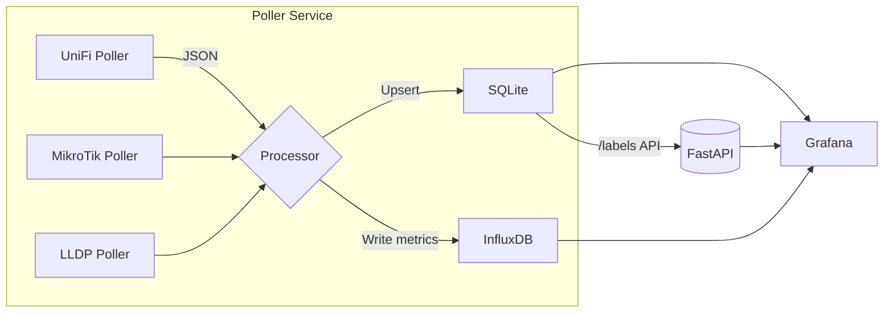

# Home Network Monitoring and Visualization

[](https://github.com/AMathur20/Home_Network/actions/workflows/ci.yml)

This project monitors and visualizes a home network's wired and wireless devices using Grafana, InfluxDB, and Python.

## Table of Contents
1. [Features](#features)
2. [Screenshots](#screenshots)
3. [Architecture](#architecture)
4. [Environment Variables](#environment-variables)
5. [Setup](#setup)
6. [Post-deployment Checklist](#post-deployment-checklist)
7. [Endpoints](#endpoints)
8. [Backup & Restore](#backup--restore)
9. [Testing](#testing)
10. [Directory Layout](#directory-layout)
11. [Contributing](#contributing)
12. [License](#license)


## Features
- Real-time and historical bandwidth stats
- Automatic and manual topology mapping
- Grafana dashboards
- Works with Ubiquiti + MikroTik

## Screenshots
Below is an example of the main Grafana dashboard once data is flowing:


> Place your own screenshot at `docs/images/dashboard.png` if you fork this repo.

## Architecture



The Python poller collects stats from UniFi and MikroTik devices, merges LLDP topology data, writes time-series metrics to InfluxDB, and stores metadata & snapshots in SQLite. Grafana queries both InfluxDB (metrics + topology) and the FastAPI `/labels` endpoint for device labels.

## Labeling Workflow
1. Grafana dashboard shows an "Edit Device Labels" link (panel at bottom).
2. Clicking the link opens `/labels` (to be implemented) where you can map MAC addresses to friendly names or locations.
3. The poller reads updated labels from SQLite on each refresh, and subsequent dashboards reflect the new labels.

## Environment Variables
Copy `.env.example` to `.env` and fill in your credentials. Key variables:

| Variable | Purpose |
|----------|---------|
| INFLUX_URL | InfluxDB base URL (e.g. `http://influxdb:8086`) |
| INFLUX_ORG | InfluxDB organisation name |
| INFLUX_BUCKET | Metrics bucket |
| INFLUX_TOKEN | API token with write access |
| UNIFI_CONTROLLER | UniFi controller URL |
| UNIFI_USER / UNIFI_PASS | UniFi credentials |
| MIKROTIK_HOST / MIKROTIK_USER / MIKROTIK_PASS | MikroTik credentials |
| POLL_INTERVAL | Override polling interval in seconds |
| ALERTS_EMAIL_TO / ALERTS_EMAIL_PASS | Email target + app password for Grafana alerts |

### Configuration tips (`config/config.yaml` vs `.env`)
Secrets such as passwords and API tokens belong in **.env** or your CI/Compose secret store. Structured runtime settings live in **config/config.yaml** and can be hot-reloaded.

Examples:
```yaml
# config/config.yaml
devices:
  unifi:
    controller: "https://192.168.1.1:8443"  # creds in env vars UNIFI_USER / UNIFI_PASS

  mikrotik:
    hosts:            # list all MikroTik routers/switches
      - "192.168.1.2"
      - "192.168.1.3"

  erx:                # EdgeRouter-X via SNMP (example)
    host: "192.168.1.10"
    snmp_community: "public"

polling:
  interval: 60  # seconds
```
`MIKROTIK_USER`, `MIKROTIK_PASS`, `UNIFI_USER`, etc. are read from the environment at runtime; if they are set, they override any YAML values.

### Example `.env`
```env
# InfluxDB
INFLUX_URL=http://influxdb:8086
INFLUX_ORG=home-net
INFLUX_BUCKET=network_metrics
INFLUX_TOKEN=changeme

# UniFi Controller
UNIFI_CONTROLLER=https://192.168.1.1:8443
UNIFI_USER=unifi_ro
UNIFI_PASS=supersecret

# MikroTik credentials (shared across hosts)
MIKROTIK_USER=poller
MIKROTIK_PASS=supersecret

# Grafana alert e-mail
ALERTS_EMAIL_TO=you@example.com
ALERTS_EMAIL_PASS=app_password
```


---

## Device-side Setup & Best Practices
Ensure each network device allows API/SNMP access from the Poller container and use *read-only* credentials wherever possible.

### UniFi Controller (UDM/Cloud-Key/UniFi Network)
1. **Create a local "Read Only" Role:**
   • Settings → Users → Roles → Add Role → select *Read Only* privileges.
2. **Add a Service User:**
   • Settings → Users → Local Users → Add User → assign the read-only role created above.
3. **API Reachability:**
   • Controller must be reachable at the `UNIFI_CONTROLLER` URL (default `https://<ip>:8443`).
   • If using self-signed HTTPS, import the CA or add `?strict=false` to the URL.
4. **Firewall:** open 8443/TCP to the Docker host only. Example on Ubuntu controller:
   ```bash
   sudo ufw allow proto tcp from <docker_host_ip> to any port 8443 comment "Allow UniFi API from poller"
   sudo ufw reload
   ```

### MikroTik Router / Switch
1. **Enable API Service:**
   ```shell
   /ip service enable api
   ```
2. **Create read-only account:**
   ```shell
   /user group add name=ro policy=read,api,!local,!telnet
   /user add name=poller group=ro password=STRONGPASS
   ```
3. **LLDP & Bridge Neighbor Discovery (for topology):**
   ```shell
   /ip neighbor discovery-settings set discover-interface-list=LAN
   /interface lldp set all transmit-enabled=yes receive-enabled=yes
   ```
4. Restrict API access in */ip firewall filter* to the poller host IP.

### EdgeRouter X (ER-X)
Depending on how you collect stats:
*SNMP (recommended):*
```bash
set service snmp community public
set service snmp listen-address 0.0.0.0
commit; save
```
Create a readonly OS user if using `ubnt-api`:
```bash
add system login user poller authentication plaintext-password STRONGPASS
set system login user poller level operator
commit; save
```
Restrict SNMP/API firewall rules to the poller host.

---

## Setup

### Quick-start on a fresh Ubuntu 22.04 server
The commands below assume you have _sudo_ access on a brand-new VM and are connected via SSH.

```bash
# 1) SSH into the machine
ssh <your-user>@<server_ip>

# 2) Update the OS and install prerequisite packages
sudo apt update && sudo apt upgrade -y
sudo apt install -y ca-certificates curl gnupg lsb-release git

# 3) Install Docker Engine + Compose plugin
curl -fsSL https://download.docker.com/linux/ubuntu/gpg | sudo gpg --dearmor -o /usr/share/keyrings/docker.gpg
echo \
  "deb [arch=$(dpkg --print-architecture) signed-by=/usr/share/keyrings/docker.gpg] https://download.docker.com/linux/ubuntu \
  $(lsb_release -cs) stable" | sudo tee /etc/apt/sources.list.d/docker.list > /dev/null
sudo apt update
sudo apt install -y docker-ce docker-ce-cli containerd.io docker-buildx-plugin docker-compose-plugin

# Add your user to the docker group (log out/in for it to take effect)
sudo usermod -aG docker $USER

# 4) Clone the repository (replace path as needed)
mkdir -p ~/apps && cd ~/apps
git clone https://github.com/AMathur20/Home_Network.git
cd Home_Network

# 5) Copy sample environment + config and edit secrets
cp .env.example .env
cp config/config.example.yaml config/config.yaml
nano .env      # edit InfluxDB & UniFi/MikroTik credentials
nano config/config.yaml  # edit IPs, polling interval, labels, etc.

# 6) Build and start the stack
docker compose up -d --build
```

Services:
- Grafana → <http://<server_ip>:3000> (user/pass `admin`/`admin`)
- InfluxDB → <http://<server_ip>:8086>
- Poller API → `POST http://<server_ip>:5000/refresh-now` to force immediate poll

### Local development (macOS / Windows)
Ensure Docker Desktop is installed, then run the same `docker compose up -d --build` command in the project root. All ports are exposed on localhost.


Grafana: http://localhost:3000  
InfluxDB: http://localhost:8086  
Refresh Topology: `POST http://localhost:5000/refresh-now`

## Post-deployment Checklist
After `docker compose up -d --build` completes:

1. Verify containers are healthy
   ```bash
   docker compose ps
   ```
   All services should show `healthy` (health-checks run every 30 s).

2. Create the InfluxDB down-sampling task (once):
   ```bash
   docker exec -it influxdb influx task create --file /etc/influxdb2/bandwidth_downsample.flux --token $INFLUX_TOKEN
   ```
   The `.flux` file is mounted automatically from `influxdb/tasks`.

3. Login to Grafana (`admin`/`admin`) and confirm the **Home Network Overview** dashboard populates bandwidth, topology, and device table panels.

4. Edit device labels (optional):
   ```bash
   # list
   curl http://<server_ip>:5000/labels

   # add/update
   curl -X POST -H "Content-Type: application/json" \
        -d '{"mac":"aa:bb:cc:dd:ee:ff", "label":"Living-Room TV"}' \
        http://<server_ip>:5000/labels

   # delete
   curl -X DELETE http://<server_ip>:5000/labels/aa:bb:cc:dd:ee:ff
   ```
   Refresh the Grafana dashboard to see updated labels.

5. Trigger an immediate poll at any time:
   ```bash
   curl -X POST http://<server_ip>:5000/refresh-now
   ```

## Endpoints
| Service | URL |
|---------|-----|
| Grafana Dashboard | `http://<server_ip>:3000` |
| InfluxDB UI | `http://<server_ip>:8086` |
| Labels UI (Bootstrap) | `http://<server_ip>:5000/labels-ui` |
| REST: List Labels | `GET http://<server_ip>:5000/labels` |
| REST: Add/Update Label | `POST http://<server_ip>:5000/labels` |
| REST: Delete Label | `DELETE http://<server_ip>:5000/labels/{mac}` |
| REST: Manual Poll Refresh | `POST http://<server_ip>:5000/refresh-now` |

## Backup & Restore
Persistent data volumes:

| Path | Container Dir | Contents |
|------|---------------|----------|
| `data/influxdb` | `/var/lib/influxdb2` | InfluxDB buckets & metadata |
| `data/sqlite` | `/app/sqlite` | SQLite DB with device metadata |

Back up these folders to preserve metrics and labels; restore them before bringing up the stack.

## Testing
```bash
pip install -r poller/requirements.txt -r requirements-dev.txt
pytest --cov
```

## Directory Layout
- `poller/`: Python service for polling and topology
- `data/`: Volume for Influx and SQLite data
- `config/`: Static config with IPs and secrets
- `grafana/provisioning`: Dashboard and data source templates

## Contributing
Pull requests are welcome! Please open an issue first to discuss major changes.

Run `pre-commit run --all-files` (if configured) and ensure tests pass before pushing.

## License
MIT © 2025 Ankur Mathur
